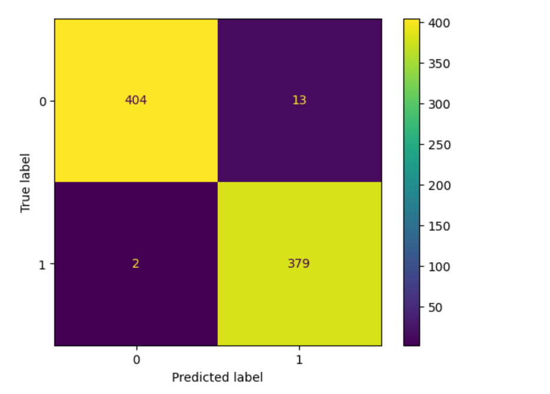

# Fake News Detection
This project is aimed at detecting fake news using machine learning. 

## Features
1. Data Preprocessing
2. Text Processing like TF-IDF Vectorization
3. Model Training using RandomForest classifier
4. Evaluation: classification reports,confusion matrix.

## Requirements
1. Install dependencies:
```bash
pip install pandas nltk scikit-learn matplotlib
```
1. Run python file
```bash
python app.py
```

## Outputs
### Confusion Matrix


